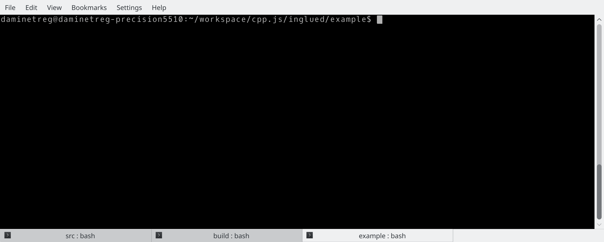

# `#inglued <>` : hiding c++ dependencies.
First [we only support header-only dependencies](doc/rationale/WHY_HEADER_ONLY.md), any other kind of libraries have to disappear.

As a library author you want your library to be used easily. 

The problem is that your users might get an hard time to consume your C++ library, if you do depend on some other library yourself.

Dependency management is hard in C++ because there are :
  - so much target platform
  - so much build systems (cmake, visual studio, scons, autotools, bjam, waf, gyp, gn, bazelbuild, ninja...)
  - so much kind of users

Your library will be consumed by two different kind of users :
  - The app developer that just copy/paste your code in his project
  - The system builder which wants clean sysroot and good transitive CMake package dependency.

## FEATURES
  * No installation needed
  * Relies on git
  * Support non-`#inglued <>` deps as well by `#include` scanning
  * Allows copy/paste of library in other project
  * Generates CMake if wanted

### Yet another dependency-manager ? NO!
Definitely not, this is only glue to ease the shipping of your header-only library. The goal of this tool is to **hide dependencies to users who doesn't care**.

It automates and ease the version upgrade of your dependencies, but application code author shouldn't bother, they will just reuse.

### Yet another dependency store ? NO!
No, we give you access to any [github.com](https://github.com/) repo which is the largest dependency store out there.

### Yet another build system ? NO!
`inglued cmake` allows you to automagically generate a correct CMakeLists.txt for your lib but you don't have to.
[Read more about CMAKE Support](doc/CMAKE_SUPPORT.md)

# We make the app developer and the system packager happy
Here is a solution to provide your library easily to your users, **without needing** your users to install **yet another tool**.

  - **Either** directly by copy/paste in user project
  - **Or** integration via installation in sysroot
    * CMake Package Config for the CMake freaks
    * CMake build files for the system packager.

# How does it work ?
It simply provides you with a way to package **dependencies** inside **your git repository**. 

And the best, is that it doesn't use the cumbersome **submodules**, but the marvelous **subtree**.

Users just need to include your library folder. The rest is done by you using `#inglued <>`.

## Adding a library in 2 steps

  1. Add a new file `deps/inglued` : 
 
```json
{
    "nlohmann/json"                   : { "@" : "v2.1.1", "-I" : "src/" }
  , "boostorg/preprocessor"           : { "@" : "boost-1.62.0", "-I" : "include/" }
  , "boostorg/fusion"                 : { "@" : "boost-1.62.0", "-I" : "include/" }
}
```

  2. Run `inglued seal`, and :boom: you can tag your lib & let users download it via [Github Releases](https://help.github.com/articles/creating-releases/).


### Example
Library [example-dependency](https://github.com/header-only/example-dependency) depends on : 

  * [nlohmann/json](https://github.com/nlohmann/json)
  * [Boost.Preprocessor](https://github.com/boostorg/preprocessor)
  * [Boost.Fusion](https://github.com/boostorg/fusion)

The users of **example-dependency** have to tediously install all these transitive dependencies and the other dependencies they also bring ? 

We've created `#inglued <>` to solve this. :wink:

#### inglued steps :
  * [Dependencies ready in deps/inglued](https://github.com/header-only/example-dependency/tree/list-your-deps)
  * `inglued seal` : [see diff](https://github.com/header-only/example-dependency/compare/list-your-deps...ran-inglued-seal)
  * `inglued cmake header-only example-dependency example-dependency` : [see diff](https://github.com/header-only/example-dependency/compare/ran-inglued-seal...ran-inglued-cmake)



#### Conclusion
Thanks to these three commands we satisfy :
  - the user who doesn't care and just want to code : 
    * He `copy/paste` your lib in it's project

  - the user who wants to integrate your lib in it's sysroot :
    * He runs : `cmake . && make install`

  - the user who wants to take it's own version of your dependencies 
    * He runs : `cmake . -DINGLUED=OFF && make install`

## Future Development ROADMAP
See our [ROADMAP](./ROADMAP.md)

## License
You don't bother as what this tool do will not have impact on your code, but in case : [Boost Software License](./LICENSE).

Please give copyright notice for this project if you find it good.

```
Copyright (c) 2017 Damien Buhl alias daminetreg (damien.buhl@lecbna.org)
```
